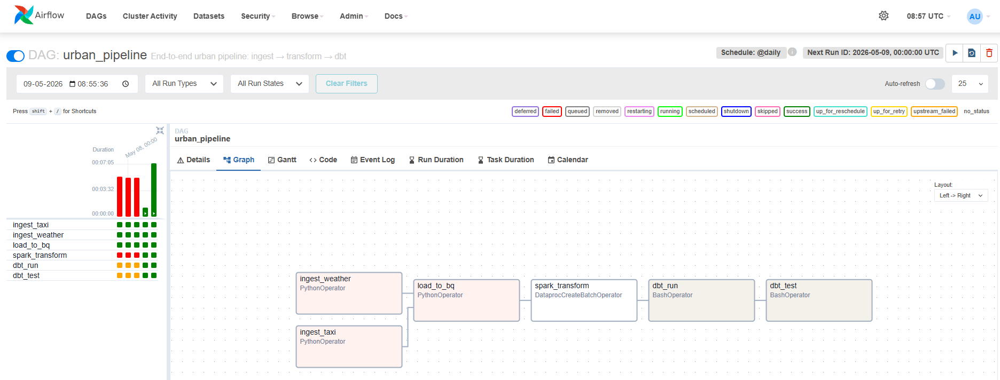

### Airflow DAG — Task Graph
# 

# Urban Intelligence Pipeline

> Production-grade batch data engineering pipeline on GCP — ingests NYC taxi trip data and hourly weather, transforms with PySpark on Dataproc Serverless, models with dbt, orchestrates with Airflow.

## Project overview

This is a 6-day portfolio project demonstrating production data engineering practices on Google Cloud Platform. It ingests **485,172** NYC Yellow Taxi trips alongside **744** hourly weather records for January 2022, joins and enriches them via PySpark on Dataproc Serverless, models them as a star schema with dbt, and orchestrates the entire pipeline end-to-end with Apache Airflow.

**Key question explored:** *How does NYC weather affect taxi trip patterns and fares?*

**Sample finding:** the pipeline correctly identifies the January 7, 2022 NYC blizzard — snowfall of 1.05–1.33 cm/hr from 4–7 AM, with average fare jumping to $34.64 at 5 AM (vs ~$25 baseline).

## Architecture

~~~
┌─────────────────────────────────────────────────────────────────┐
│                         DATA SOURCES                             │
│   BigQuery Public Dataset           Open-Meteo API (Free)        │
│   NYC Yellow Taxi 2022              Hourly NYC Weather 2022      │
│   485,172 records                   744 hourly records           │
└──────────────┬───────────────────────────────┬──────────────────┘
               │                               │
               ▼                               ▼
┌─────────────────────────────────────────────────────────────────┐
│                       INGESTION LAYER                            │
│   taxi_ingestion.py        weather_ingestion.py                  │
│   load_to_bigquery.py                                            │
│              GCS Raw Bucket (Parquet + JSON)                     │
│         partitioned by ingestion_date (Hive-style)               │
└──────────────────────────────┬──────────────────────────────────┘
                               │
                               ▼
┌─────────────────────────────────────────────────────────────────┐
│                    TRANSFORMATION LAYER                          │
│         PySpark on GCP Dataproc Serverless (zero idle cost)      │
│   spark_transform.py — join taxi+weather + feature engineering   │
│   Writes to BigQuery: partitioned by pickup_date,                │
│   clustered by (pickup_hour, pickup_location_id)                 │
│                  484,091 rows after join                         │
└──────────────────────────────┬──────────────────────────────────┘
                               │
                               ▼
┌─────────────────────────────────────────────────────────────────┐
│                      MODELLING LAYER (dbt)                       │
│   stg_trips (view) → fct_trips (484,091 rows, 18.5 MB physical)  │
│   dim_dates · dim_locations · 14 data quality tests              │
│             BigQuery marts dataset (star schema)                 │
└──────────────────────────────┬──────────────────────────────────┘
                               │
                               ▼
┌─────────────────────────────────────────────────────────────────┐
│                  ORCHESTRATION LAYER (Airflow)                   │
│    6-task DAG · @daily schedule · parallel ingestion             │
│    Docker locally · Composer-ready for cloud                     │
└──────────────────────────────┬──────────────────────────────────┘
                               │
                               ▼
                     Analysis-ready marts
~~~

## Tech stack

| Layer            | Technology                  | Detail                                                    |
|------------------|-----------------------------|-----------------------------------------------------------|
| Infrastructure   | Terraform 1.5+              | 24 GCP resources via IaC, GCS-backed remote state         |
| Storage          | GCS (3 buckets)             | Raw, staging, scripts; lifecycle 90d, public access blocked |
| Data warehouse   | BigQuery                    | Raw, staging, marts datasets — partitioned + clustered    |
| Ingestion        | Python 3.11 + GCS/BQ SDK    | Public BigQuery + Open-Meteo REST API → Parquet/JSON       |
| Transformation   | PySpark 3.5 on Dataproc Serverless | Join + feature engineering; scales to zero          |
| Modelling        | dbt-bigquery 1.8            | Star schema · 14 tests (11 generic + 3 singular)          |
| Orchestration    | Apache Airflow 2.10         | 6-task DAG via Docker (LocalExecutor)                     |
| Auth             | OAuth + ADC                 | No service-account keys (org policy compliant)            |
| CI/CD            | GitHub Actions              | DAG syntax · dbt parse · Python lint                      |
| Languages        | Python · SQL · HCL · YAML   |                                                           |

## Project structure

~~~
urban-intelligence-pipeline/
├── .github/workflows/             # CI: DAG validation, dbt parse, Python lint
├── terraform/                     # IaC — 24 GCP resources
│   ├── apis.tf                    # 10 enabled APIs
│   ├── gcs.tf                     # 3 GCS buckets with lifecycle
│   ├── bigquery.tf                # 3 BigQuery datasets
│   ├── iam.tf                     # SA + 8 IAM bindings
│   └── ...
├── ingestion/batch/               # Python: extract → GCS → BQ raw
│   ├── taxi_ingestion.py          # 485K rows from BQ public dataset
│   ├── weather_ingestion.py       # 744 hours from Open-Meteo
│   └── load_to_bigquery.py
├── transform/
│   └── spark_transform.py         # Dataproc Serverless PySpark job
├── dbt/urban_pipeline_dbt/
│   ├── models/staging/            # stg_trips with surrogate keys
│   ├── models/marts/              # dim/fact star schema
│   ├── tests/                     # 3 singular tests (positive_fares, etc.)
│   └── analyses/                  # data_freshness, weather_impact_summary
├── airflow/
│   ├── docker-compose.yml         # Postgres + scheduler + webserver
│   └── dags/urban_pipeline_dag.py # 6-task DAG
├── tests/                         # pytest smoke tests (11 tests)
├── docs/
│   └── ADR-001-platform-choices.md  # Architecture Decision Record
└── README.md
~~~

## Data layers

| Layer  | Location                                                              | Format                                                                                | Volume                          |
|--------|-----------------------------------------------------------------------|---------------------------------------------------------------------------------------|---------------------------------|
| Raw | `gs://urban-pipeline-kd-2026-raw/{taxi,weather}/ingestion_date=YYYY-MM-DD/` | Parquet + JSON | 31 daily partitions: ~2.4M trips + 744 weather hours total |
| Bronze | BigQuery `raw.*` | Native BQ | Currently 1 day until Day 8 fixes WRITE_TRUNCATE; will be ~2.4M trips |
| Silver | BigQuery `staging.taxi_trips_enriched` | Partitioned by `pickup_date`, clustered by `pickup_hour, pickup_location_id` | To be regenerated in Day 8 |
| Gold | BigQuery `marts.{dim_dates, dim_locations, fct_trips}` | Star schema | To be regenerated in Day 8 |                                                                         | fct_trips: 484K rows, 18.5 MB physical |

## Build log — 6 days

### Day 1 — Terraform foundation

Provisioned 24 GCP resources via Terraform: 10 APIs enabled, 3 GCS buckets (raw/staging/scripts) with uniform bucket-level access and 90-day lifecycle, 3 BigQuery datasets, dedicated service account `urban-pipeline-sa` with 8 IAM roles, and remote state in `gs://urban-pipeline-kd-2026-tf-state`.

### Day 2 — Python ingestion

Built three ingestion scripts: taxi pull from BigQuery public dataset (`bigquery-public-data.new_york_taxi_trips.tlc_yellow_trips_2022`) cleaning to 485K rows; Open-Meteo API call producing 744 hourly records; parquet/JSON loaders into BQ raw.

### Day 3 — PySpark on Dataproc Serverless

Wrote `spark_transform.py` that reads BQ raw, joins on `date_trunc('hour', pickup_datetime) == to_timestamp(time)`, derives `is_raining`, `is_snowing`, `weather_severity` (clear/freezing/light_rain/heavy_rain/blizzard), `tip_pct`. Submitted as Dataproc Serverless batch with `writeMethod=indirect` to preserve partitioning. Output: 484K rows across 31 daily partitions.

**Key insight:** the January 7, 2022 NYC blizzard surfaced — 4-7 AM saw 1+ cm/hr snowfall and average fare of $34.64.

### Day 4 — dbt models

Set up dbt-bigquery with OAuth via ADC. Built `stg_trips` (view), `dim_dates` (date spine 2022-01-01 to 2022-12-31), `dim_locations` (260 distinct pickup+dropoff zones), and `fct_trips` (484,091 rows, 31 partitions, 18.49 MB physical). All 11 generic tests passing.

### Day 5 — Airflow orchestration

Built 6-task DAG running ingestion → load → Spark transform → dbt run → dbt test. Deployed via Docker Compose (postgres + scheduler + webserver) using LocalExecutor. Worked around org-level service-account key restriction by mounting ADC credentials as a Docker volume.

### Day 6 — Tests, monitoring, README

Added pytest smoke tests for ingestion modules (11 tests). Added 3 singular dbt tests (`positive_fares`, `no_future_trips`, `dropoff_after_pickup`). Added monitoring SQL analyses (`data_freshness`, `weather_impact_summary`). Created GitHub Actions CI workflow.

## Key engineering decisions

- **Dataproc Serverless over cluster**: zero idle cost, scales to zero between runs.
- **Indirect write mode + `createDisposition=CREATE_IF_NEEDED`**: BQ Spark connector silently dropped partitioning config in direct mode.
- **OAuth/ADC over service account keys**: org policy `iam.disableServiceAccountKeyCreation` enforced; ADC volume-mounted into Airflow containers.
- **Hive-style date partitioning in raw bucket**: `taxi/ingestion_date=YYYY-MM-DD/` enables efficient time-range scans.
- **Surrogate keys via wide MD5**: `MD5(pickup_dt, dropoff_dt, pickup_loc, dropoff_loc, fare, tip, distance)` — narrower hashes produced ~36 collisions.
- **Cluster on `pickup_hour, pickup_location_id`**: matches the most common analytical query pattern (hourly breakdowns by zone).

See [`docs/ADR-001-platform-choices.md`](docs/ADR-001-platform-choices.md) for a full architecture decision record.

## Tests

~~~bash
# Python smoke tests (module imports, constants, file structure)
pytest tests/ -v

# dbt tests (11 generic + 3 singular)
cd dbt/urban_pipeline_dbt && dbt test --profiles-dir ~/.dbt
~~~

CI runs both on every push to `main`.

## Cost

Approximate cost for one full pipeline run on GCP:

| Component | Cost |
| --- | --- |
| GCS storage (raw bucket, ~50 MB across 31 partitions) | <$0.01 |
| BigQuery storage (post-Day 8: ~500 MB physical) | <$0.01 |
| BQ public-dataset queries (31 × ~30 MB partition scan) | $0 (covered by user's free tier) |
| Dataproc Serverless batch (one run per backfill) | ~$0.10 |
| dbt run on BQ (post-Day 8: incremental fct_trips) | ~$0.01 |
| **Total for full January 2022 backfill** | **~$0.12** |

Per-day incremental runs (Day 8+) will be substantially cheaper since dbt processes only new partitions.

## Sample analytical query

    -- Trips per day across January 2022 — captures the Jan 28-29 Nor'easter
    select
        pickup_date,
        count(*) as trips,
        round(avg(fare_amount), 2) as avg_fare
    from `urban-pipeline-kd-2026.marts.fct_trips`
    where pickup_date between '2022-01-01' and '2022-01-31'
    group by 1
    order by 1

The January 28-29 Nor'easter is visible in the data: Friday Jan 28 had 95,873 trips (a normal weekday volume), Saturday Jan 29 collapsed to 34,388 trips (less than half the surrounding Saturdays), and Sunday Jan 30 partially recovered to 71,229 as the city dug out. To be re-verified end-to-end once Day 8 fixes the WRITE_TRUNCATE issue and rebuilds `fct_trips` from the full backfill.
~~~

## Running locally

### Prerequisites

- gcloud CLI authenticated (`gcloud auth application-default login`)
- Python 3.11 with venv
- Terraform >= 1.5
- Docker Desktop (for Airflow)
- A GCP project with billing enabled

### Setup

~~~bash
# 1. Set up GCP project + remote state bucket
gcloud projects create urban-pipeline-kd-2026
gcloud storage buckets create gs://urban-pipeline-kd-2026-tf-state --location=US

# 2. Provision infrastructure
cd terraform
cp terraform.tfvars.example terraform.tfvars  # edit your project ID
terraform init && terraform apply

# 3. Python environment
cd ..
python -m venv venv && source venv/Scripts/activate
pip install -r requirements.txt

# 4. Run pipeline manually (one-shot)
python ingestion/batch/taxi_ingestion.py
python ingestion/batch/weather_ingestion.py
python ingestion/batch/load_to_bigquery.py

gcloud storage cp transform/spark_transform.py gs://urban-pipeline-kd-2026-scripts/transform/
gcloud dataproc batches submit pyspark \
    gs://urban-pipeline-kd-2026-scripts/transform/spark_transform.py \
    --batch=urban-pipeline-$(date +%s) --region=us-central1 \
    --service-account=urban-pipeline-sa@urban-pipeline-kd-2026.iam.gserviceaccount.com \
    --version=2.2 --jars=gs://spark-lib/bigquery/spark-3.5-bigquery-0.42.0.jar \
    -- --project=urban-pipeline-kd-2026 --raw-dataset=raw \
       --staging-dataset=staging --gcs-temp-bucket=urban-pipeline-kd-2026-staging

cd dbt/urban_pipeline_dbt && dbt build --profiles-dir ~/.dbt

# 5. OR run end-to-end via Airflow
cd ../../airflow
echo "AIRFLOW_UID=50000" > .env
docker compose up airflow-init
docker compose up -d
# Open http://localhost:8080, login admin/admin, trigger urban_pipeline DAG

### Backfill historical dates

The DAG ingests for one day at a time using Airflow's `{{ ds }}` macro (logical date / data_interval_start). For one-off historical loads — for example, populating January 2022 to demo the pipeline — use the standalone backfill script:

    # Populate 31 GCS partitions (~7 minutes, ~$0 marginal cost)
    python scripts/backfill.py --start-date 2022-01-01 --end-date 2022-01-31

    # Resume after a failure — skips dates whose GCS partition already exists
    python scripts/backfill.py --start-date 2022-01-01 --end-date 2022-01-31 --skip-if-exists

    ~~~

The script only writes to GCS. To materialize a single day into BigQuery for inspection:

    python ingestion/batch/load_to_bigquery.py --ingestion-date 2022-01-31

`load_to_bigquery.py` currently uses `WRITE_TRUNCATE`, so each invocation replaces the BigQuery table with that one day's data. Day 8 will partition the raw tables and switch to DELETE-then-APPEND so the full month materializes.

## Architecture Decision Record

See [`docs/ADR-001-platform-choices.md`](docs/ADR-001-platform-choices.md) for the rationale on Dataproc Serverless vs cluster, OAuth/ADC vs service account keys, and Docker Airflow vs Cloud Composer.

## Author

**Kaushik Das**
Data Engineer · GCP · BigQuery · dbt · Airflow

[GitHub](https://github.com/kaushikdascult)

## License

MIT